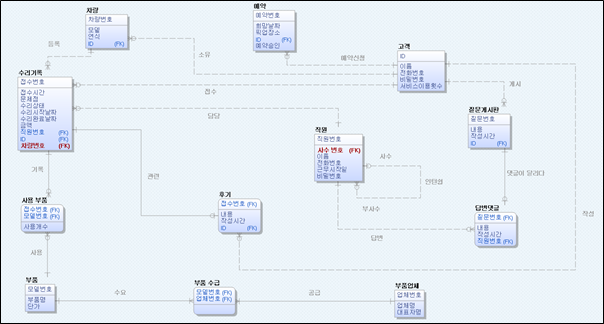
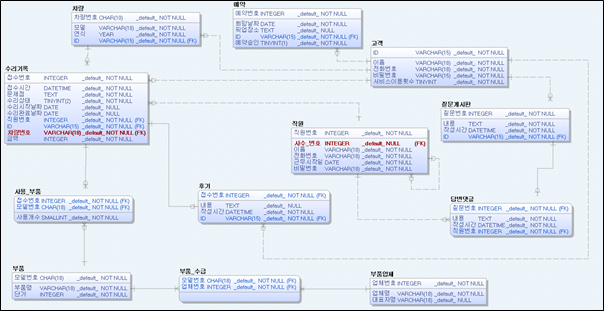

# MySQL, Node.js, Vue를 이용한 '카 센터 관리 홈페이지'
* [동영상 링크](https://www.youtube.com/watch?v=Ac3FZgG-5a8 "유튜브")  

#### 요구사항
1. ICE사 자동차 정비소의 고객은 홈페이지 회원가입을 통해 회원이 될 수 있다. 회원은 ID로 식별되고 비밀번호, 이름, 전화번호, 서비스 이용횟수의 정보가 저장된다. 고객은 서비스 이용 횟수에 따라 다시 우수고객과 일반고객으로 구분된다.
직원은 직원번호로 구별된다. 이를 통해 홈페이지에 가입 및 로그인이 가능하며, 비밀번호, 근무시작일, 전화번호, 이름이 저장되어있다. 직원 중에는 인턴쉽 과정을 수료중인 인턴직원이 있으며, 인턴직원에게는 사수직원의 정보가 추가로 저장된다.

2. 고객은 홈페이지를 통해 원하는 날짜를 선택하여 수리 예약을 할 수 있으며, 예약정보는 예약번호로 구분되어 저장된다. 다만 하루에 일정 개수 이상의 예약이 있다면 그 날짜는 선택할 수 없게 된다. 신청한 예약에 대해 승인이 된다면, 신청 날짜에 수리 접수가 이루어진다. 예약과정에서 이용자는 차량 픽업 옵션을 선택을 할 수 있는데, 이는 고객이 픽업 장소를 지정하면 직원이 신청 날짜에 그 장소로 이동하여 수리를 접수하고 차량을 픽업하는 서비스이다. 이 옵션을 선택하지 않은 경우에는 고객이 예약 날짜에 센터로 직접 가서 접수를 해야 한다.

3. 접수가 완료된 고객의 수리기록은 접수번호로 구별된다. 추가로 수리기록엔 고객의 차량번호, 접수시간, 차량의 문제점, 수리상태, 수리기간, 수리금액, 담당 직원의 정보가 추가로 저장이 돼야 한다.  이용자는 접수 과정에서 담당 직원을 직접 선택할 수도 있다. 담당 직원을 선택하지 않는다면 임의로 담당직원이 결정된다. 다만 인턴 직원을 담당 직원으로 선택할 수 없다.
고객은 자신의 접수 건에 대한 수리기록을 열람할 수 있어야 한다.
수리상태에는 수리 전, 수리 중, 수리완료 중 하나로 표시돼야 하며, 수리 완료가 아닐 때에는 수리 완료날짜는 예상 날짜로, 수리 금액은 예상 금액으로 표시된다. 

4. 고객은 수리기록을 통해 수리에 사용된 부품의 정보도 얻을 수 있어야 한다. 부품은 부품의 모델 번호로 구분되며, 사용개수, 부품 명, 단가 정보가 저장된다. 또한 부품을 제공한 부품 업체는 업체번호로 식별되며, 업체 명과 대표자의 이름이 저장된다.

5. 수리가 완료된 접수 건에 대해 고객은 후기게시판에 리뷰를 작성할 수 있어야 한다. 각 후기는 접수번호로 구분이 되며, 작성시간, 작성자, 후기내용의 정보가 추가로 저장되어야 한다.

6. 고객은 궁금한 사항을 질문게시판에 게시 할 수 있고, 직원은 댓글을 통해 그 질문에 대한 답변을 달 수 있다. 질문은 질문번호로 구별되며, 작성 시간, 그리고 질문내용이 저장된다. 
직원의 답변댓글은 질문 당 하나가 등록될 수 있으며, 질문번호를 통해 식별되고 작성 시간과 내용이 저장된다. 


### 데이터베이스 설계 최종 프로젝트

           인하대학교 정보통신공학과 박광석  
           인하대학교 정보통신공학과 최유진  
           인하대학교 정보통신공학과 권정훈  


# project

> A Vue.js project

## Build Setup

``` bash
# install dependencies
npm install

# serve with hot reload at localhost:8080
npm run dev

# build for production with minification
npm run build  

  
    
  
  
